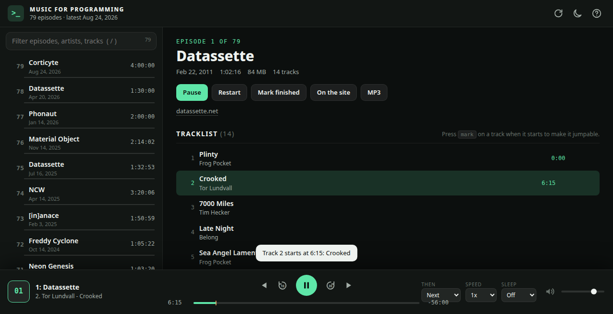

# webmusicfp

A local web player for [musicforprogramming.net](https://musicforprogramming.net).
Episode list, tracklists, resume, keyboard control. Built to live in
a Rambox tab. Node only, no dependencies, no build step.



## Run it

```sh
npm run refresh          # scrape the site into public/episodes.json
npm start                # http://127.0.0.1:8421
PORT=9000 npm start      # pick another port
npm test
```

Environment:

| Variable        | Default                          | Meaning                                  |
| --------------- | -------------------------------- | ---------------------------------------- |
| `PORT`          | `8421`                           | Port to listen on                        |
| `HOST`          | `127.0.0.1`                      | Bind address (`0.0.0.0` for LAN)         |
| `EPISODES_FILE` | `public/episodes.json`           | Where the refresh script writes          |
| `SITE_URL`      | `https://musicforprogramming.net`| Site the refresh script scrapes          |

## Run it as a service

```sh
scripts/install-service.sh          # picks the first free port from 8421 up
scripts/install-service.sh 9000     # or choose one
scripts/uninstall-service.sh
```

The install script writes two systemd user units to `~/.config/systemd/user/`:
`webmusicfp.service` runs the static server, and `webmusicfp-refresh.timer`
runs the scraper once a day. Both come back after reboot.

```sh
systemctl --user status webmusicfp
systemctl --user list-timers webmusicfp-refresh.timer
journalctl --user -u webmusicfp-refresh -f
```

## How it is put together

- `public/` is the whole app: the page, `app.js`, `style.css`, and
  `episodes.json`. Any static host can serve it.
- `scripts/refresh.js` scrapes the site into `public/episodes.json`. Every
  episode page embeds a JSON-like object with the mp3 url, duration, date and
  tracklist. A full scrape takes about ten seconds. Later runs only fetch new
  episodes.
- `server.js` is a plain static file server for local use.
- Playback state (last episode, position per episode, finished episodes) and
  preferences live in the browser's `localStorage`. They belong to one browser
  profile and are not shared between devices.

Audio goes straight from the browser to the mp3 host.

On a phone the page shows one pane at a time. Two tabs under the header,
"Episodes" and "Episode", switch between the list and the episode pane.
Tapping an episode row opens it; the play icon on a row plays it without
leaving the list. The bar keeps the transport buttons and mute; the volume
slider is hidden since phones have hardware volume keys.

## Tracks

The tracklist works like a playlist: click a track to jump to it, and the
prev/next buttons (or `[` and `]`) step through tracks. After the last track
the player rolls into the next episode.

The site does not publish timestamps, so track times are approximate: the
tracks are spread evenly over the file.

## Visualizer

A ring of frequency bars around the big play button, the same idea as in
`webplayer`. Bass is at the bottom, treble at the top, with peak caps that hold
and fall. The level range adapts to the material, since these mixes are much
quieter than a radio stream. Toggle it with the bars icon or `v`.

## Keyboard

| Key                     | Action                                     |
| ----------------------- | ------------------------------------------ |
| `space`, `k`            | Play / pause                               |
| `←` `→`                 | Back / forward 10 s                        |
| `shift`+`←` `→`         | Back / forward 5 min                       |
| `j` `l`                 | Back / forward 1 min                       |
| `0` … `9`               | Jump to 0% … 90%                           |
| `[` `]`                 | Previous / next track                      |
| `p` `n`                 | Previous / next episode                    |
| `↑` `↓`, `m`            | Volume, mute                               |
| `/`                     | Filter episodes (matches tracks too)       |
| `r`                     | After an episode: next or random           |
| `t`, `v`, `?`           | Theme, visualizer, help                    |

## Docker

```sh
./docker_build.sh                 # build and push gitea.gitpal.ru/alex/webmusicfp
docker run -p 8421:8421 gitea.gitpal.ru/alex/webmusicfp
```

The container serves `public/` and refreshes the episode list every
`REFRESH_HOURS` (default 24, `0` disables) in the background.
